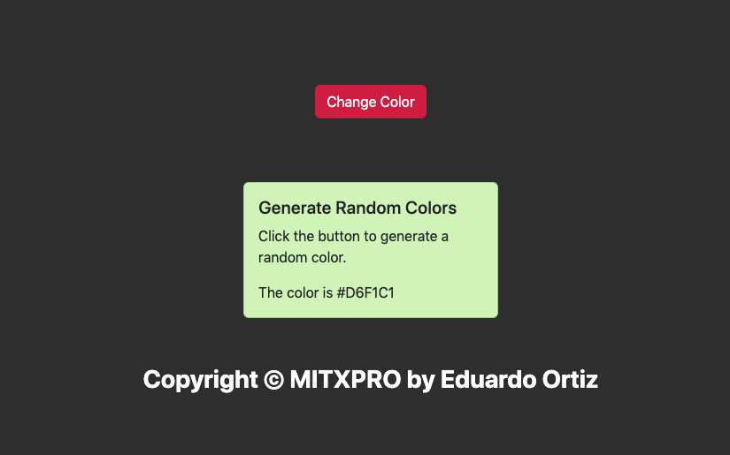

<div align="center" id="top">
     
</div>

# <h1 align="center">Fetch and Render Data</h1>

<p align="center">
  <a href="#dart-description">Description</a> &#xa0; | &#xa0; 
  <a href="#dart-demo">Demo</a> &#xa0; | &#xa0;
  <a href="#memo-improvements">Improvements</a> &#xa0; | &#xa0;
  <a href="#art-technologies">Technologies</a> &#xa0; | &#xa0;
  <a href="#white_check_mark-requirements">Requirements</a> &#xa0; | &#xa0;
  <a href="#toolbox-installation">Installation</a> &#xa0; | &#xa0;
  <a href="#joystickhow-to-play">How to Play</a> &#xa0; | &#xa0;
  <a href="#briefcase-license">License</a> &#xa0; | &#xa0;
  <a href="https://github.com/arturomsoberanes" target="_blank">Author</a>
</p>

<br>


## :dart: Description ##

Fetch and Render Data is a project from week 15 of the MITXPRO "Full-Stack with MERN" certification, In this project we create an App that brings data from an API and renders the components according to the data..
To make this project use [Create React App](https://create-react-app.dev/)

## :dart: DEMO ##

If you want to try it just click [here](https://eduardo-ortiz09.github.io/fetch-and-render-data/)

## :memo: Improvements ##

These are the list of currect improvements:

- :diamonds: Add a input for search colors.	
- :diamonds: Add option to transform the different color types (RGB to Hexadecimal).

## :art: Technologies ##

- [HTML](https://www.w3schools.com/html/)
- [CSS](https://www.w3schools.com/css/)
- [JavaScript](https://www.w3schools.com/js/)
- [React](https://reactjs.org/)

## :white_check_mark: Requirements ##

Before starting :checkered_flag:, you need to have:
- [Git](https://git-scm.com).
- [Node.js](https://nodejs.org/en/).
- [Create React App](https://create-react-app.dev/).

## :toolbox: Installation ##

Clone Repository

```bash
$ git clone https://github.com/eduardo-ortiz09/fetch-and-render-data.git
```
Change the name of directory

```bash
$ mv fetch-and-render-data fetch-and-render-data-2
```
Install Create React App.

```bash
$ npx create-react-app my-app 
```

Replace the files for the app.

```bash
$ cp -r fetch-and-render-data-2/ my-app/ 
```

## :joystick:	How to Run ##

Access in directory

```bash
$ cd my-app
```

Execute "start"

```bash
$ npm start
```


## :briefcase:	 License ##

This project is under license from MIT. For more details, see the [LICENSE](LICENSE) file.


Made with :heart: by <a href="https://github.com/eduardo-ortiz09" target="_blank">Eduardo Ortiz</a>

&#xa0;

<a href="#top">Back to top</a>

